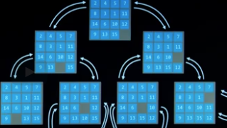
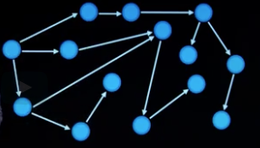

# [lecture 0](../README.md)

In computer science, a search algorithm is an algorithm (typically involving a multitude of other, more specific algorithms which solves a search problem. Search algorithms work to retrieve information stored within some data structure, or calculated in the search space of a problem domain, either with discrete or continuous values.

###### From Wikipedia, the free encyclopedia

## search
solving a puzzle maze may need a search algorithm,
or choosing the right drive way. google maps is constantly figuring out the best route to get from point A to point B.

## terminologies

* ### agents
entity that proceives its environment
and act upon that environment.
* ### state
a configuration of a agent and its environment. like a initial state in a 15 puzzle game, or the state after a tile has moved. a state is some configuration of the tile.
* ### initial state
the state where the agent begins, the starting point of a searching algorithm.

* ### actions
choices that transform a state to the next state. choices that can be made in a state. Actions(state s) returns the set of actions that can be executed in state s.
    /slideTiletoRight(state);
    /slideTiletoLeft(state);
    /slideTiletoUp(state);
    /slideTiletoDown(state);

* ### transition model
a desciption of what state results from performing any applicable action in any state.
#### example:
result(state s, action a) returns the state reulting from performing action a in state s.

* ### state space
the set of all the states reachable from the initial state by any sequence of actions.

    

* ### Node
the nodes(circle) is a repersentation of a state, and nodes are connected together by actions(arrows).

    

* ### goal test
a way to determine whether a given state is a goal state.

* ### path cost
numerical cost associated with a given path. 
